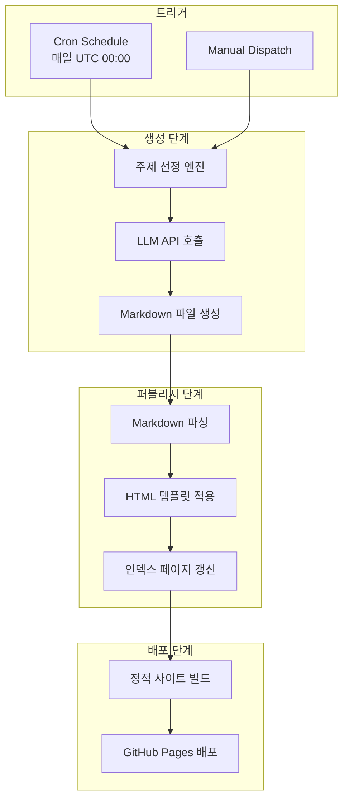
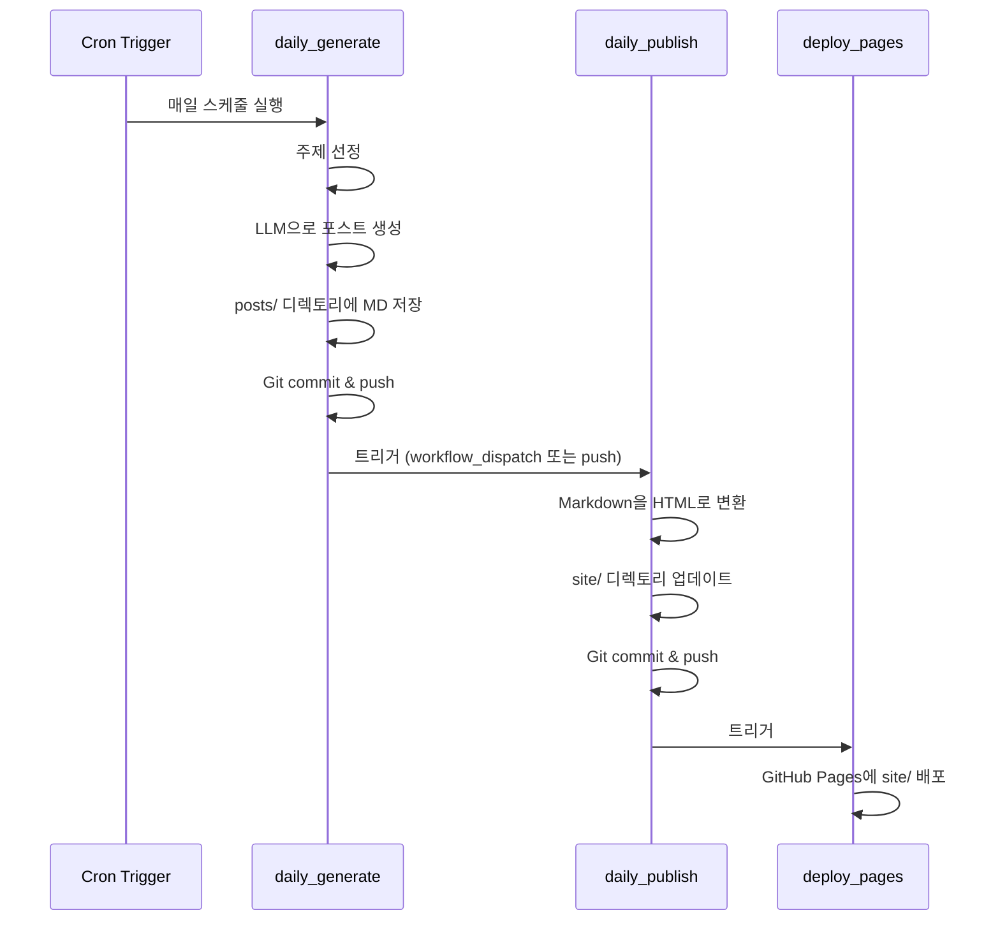

# Architecture

> 콘텐츠 파이프라인 아키텍처, 시스템 구성, 배포 흐름

## 전체 파이프라인 개요


## 상세 아키텍처



## GitHub Actions 워크플로우 구성

3개의 워크플로우가 체인으로 연결되어 전체 파이프라인을 형성합니다.



### 워크플로우 상세

| 워크플로우 | 파일 | 트리거 | 역할 |
|-----------|------|--------|------|
| `daily_generate` | `.github/workflows/daily_generate.yml` | cron, manual | 새 포스트 생성 |
| `daily_publish` | `.github/workflows/daily_publish.yml` | workflow_run, manual | MD를 HTML로 변환 |
| `deploy_pages` | `.github/workflows/deploy_pages.yml` | workflow_run, push to main | GitHub Pages 배포 |

## 디렉토리 구조와 데이터 흐름

```
medium/
├── posts/                # [INPUT] AI가 생성한 Markdown 포스트
│   ├── 2024-01-15-python-async.md
│   ├── 2024-01-16-docker-tips.md
│   └── ...
├── src/
│   ├── generator/        # [PROCESS] 콘텐츠 생성 엔진
│   │   ├── topic.py      # 주제 선정 로직
│   │   ├── writer.py     # LLM 기반 글 작성
│   │   └── formatter.py  # Markdown 포맷팅
│   ├── builder/          # [PROCESS] HTML 빌드 엔진
│   │   ├── parser.py     # Markdown 파싱
│   │   ├── renderer.py   # HTML 렌더링
│   │   └── indexer.py    # 인덱스 페이지 생성
│   └── utils/
│       └── config.py     # 설정 관리
├── templates/            # [TEMPLATE] HTML 템플릿
│   ├── base.html
│   ├── post.html
│   └── index.html
└── site/                 # [OUTPUT] 빌드된 정적 사이트
    ├── index.html
    ├── posts/
    │   ├── python-async.html
    │   └── ...
    └── assets/
        ├── style.css
        └── script.js
```

## 기술 설계 결정

### 정적 사이트 생성기 직접 구현
- Jekyll이나 Hugo 대신 커스텀 Python 빌더를 사용하여 완전한 제어 가능
- 포스트 메타데이터, 태그, 카테고리 등 커스텀 처리 용이
- 의존성 최소화로 CI/CD 파이프라인 단순화

### GitHub Actions 체인
- 각 단계를 독립 워크플로우로 분리하여 디버깅 및 재실행 용이
- `workflow_run` 이벤트로 안정적인 체인 구성
- 개별 워크플로우를 수동으로 실행 가능 (manual dispatch)

### GitHub Pages 배포
- 별도 호스팅 비용 없음
- HTTPS 자동 지원
- 커스텀 도메인 연결 가능
