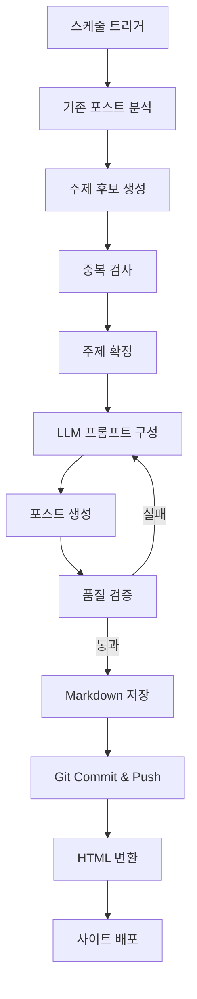
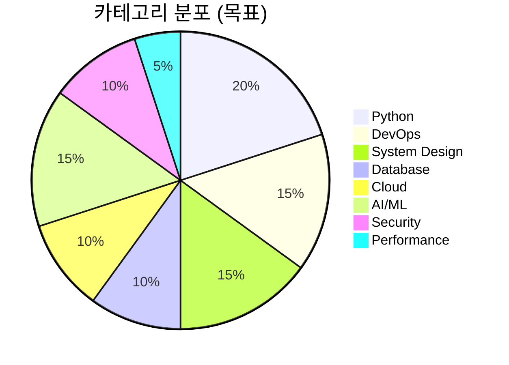

# Content Pipeline

> 포스트 생성 주기, 주제 선정 로직, 품질 관리

## 콘텐츠 파이프라인 개요



## 포스트 생성 주기

### 일일 스케줄

| 시간 (UTC) | 시간 (KST) | 이벤트 |
|-----------|-----------|--------|
| 00:00 | 09:00 | `daily_generate` 워크플로우 시작 |
| 00:05 | 09:05 | 주제 선정 완료 |
| 00:10 | 09:10 | LLM 포스트 생성 완료 |
| 00:12 | 09:12 | Git commit & push |
| 00:15 | 09:15 | `daily_publish` 워크플로우 시작 |
| 00:20 | 09:20 | HTML 빌드 완료 |
| 00:25 | 09:25 | GitHub Pages 배포 완료 |

### 생성 빈도
- 기본: 매일 1개 포스트
- 주말 포함/제외 설정 가능
- 수동 트리거로 추가 생성 가능

## 주제 선정 로직

### 1단계: 기존 포스트 분석

```python
# src/generator/topic.py
def analyze_existing_posts(posts_dir: str) -> dict:
    """기존 포스트의 주제, 태그, 카테고리를 수집합니다."""
    existing_topics = []
    existing_tags = set()
    category_counts = {}
    
    for post_file in Path(posts_dir).glob("*.md"):
        frontmatter = parse_frontmatter(post_file)
        existing_topics.append(frontmatter["title"])
        existing_tags.update(frontmatter.get("tags", []))
        cat = frontmatter.get("category", "General")
        category_counts[cat] = category_counts.get(cat, 0) + 1
    
    return {
        "topics": existing_topics,
        "tags": existing_tags,
        "category_distribution": category_counts,
    }
```

### 2단계: 주제 후보 생성

카테고리 풀에서 가중치 기반으로 후보 주제를 생성합니다:



### 3단계: 중복 검사

- 기존 포스트 제목과의 유사도 비교 (TF-IDF 코사인 유사도)
- 유사도 임계값(0.7) 이상이면 후보에서 제외
- 최근 7일 내 같은 카테고리 포스트가 있으면 우선순위 낮춤

### 4단계: 주제 확정

```python
def select_topic(candidates: list, existing: dict) -> str:
    """중복 검사를 거친 후보 중 최적 주제를 선정합니다."""
    # 카테고리 균형 점수 계산
    for candidate in candidates:
        cat = candidate["category"]
        balance_score = 1.0 / (existing["category_distribution"].get(cat, 0) + 1)
        candidate["score"] = balance_score * candidate["relevance"]
    
    # 점수 기준 정렬 후 상위 주제 선택
    candidates.sort(key=lambda x: x["score"], reverse=True)
    return candidates[0]
```

## LLM 프롬프트 구성

### 프롬프트 구조

```
[시스템 프롬프트]
당신은 기술 블로그 작성자입니다. 실용적이고 구체적인 기술 포스트를 작성합니다.

[사용자 프롬프트]
다음 주제로 기술 블로그 포스트를 작성해주세요:
- 주제: {topic}
- 서브토픽: {subtopics}
- 대상 독자: 중급 이상 개발자
- 분량: 1500-2500 단어
- 형식: Markdown with frontmatter

요구사항:
1. 실제 코드 예제 포함
2. 실무에서 바로 적용 가능한 내용
3. 장단점 비교 또는 성능 벤치마크 포함
4. 결론에 핵심 요약 포함
```

### 프롬프트 변형

| 포스트 유형 | 프롬프트 특징 |
|-----------|-------------|
| Tutorial | 단계별 가이드, 코드 예제 중심 |
| Deep Dive | 내부 동작 원리 설명, 다이어그램 활용 |
| Comparison | 기술 비교, 장단점 테이블, 의사결정 가이드 |
| Best Practices | 패턴과 안티패턴, 실무 경험 기반 |
| News/Trends | 최신 기술 동향, 영향 분석 |

## 품질 검증

생성된 포스트는 자동 품질 검증을 거칩니다:

### 검증 항목

| 항목 | 기준 | 실패 시 동작 |
|------|------|------------|
| 분량 | 1000단어 이상 | 재생성 |
| Frontmatter | title, date, tags 필수 | 자동 보완 |
| 코드 블록 | 최소 1개 이상 | 재생성 |
| Markdown 문법 | 유효한 Markdown | 자동 수정 |
| 중복 검사 | 기존 포스트와 유사도 < 0.7 | 새 주제로 재생성 |

### 품질 점수

```python
def quality_check(content: str) -> tuple[bool, float]:
    """포스트 품질을 0-1 점수로 평가합니다."""
    score = 0.0
    
    # 분량 체크 (0.2)
    word_count = len(content.split())
    score += min(0.2, (word_count / 2000) * 0.2)
    
    # 코드 블록 체크 (0.2)
    code_blocks = content.count("```")
    score += min(0.2, (code_blocks / 6) * 0.2)
    
    # 구조 체크 - 헤딩 수 (0.2)
    headings = content.count("\n#")
    score += min(0.2, (headings / 5) * 0.2)
    
    # Frontmatter 체크 (0.2)
    has_frontmatter = content.startswith("---")
    score += 0.2 if has_frontmatter else 0.0
    
    # 리스트/테이블 체크 (0.2)
    has_structure = "|" in content or "- " in content
    score += 0.2 if has_structure else 0.0
    
    passed = score >= 0.6
    return passed, score
```

## 콘텐츠 통계

### 월간 리포트 생성

매월 초 자동으로 콘텐츠 통계 리포트를 생성합니다:
- 총 포스트 수
- 카테고리별 분포
- 평균 단어 수
- 인기 태그 Top 10
- 생성 성공/실패 비율
