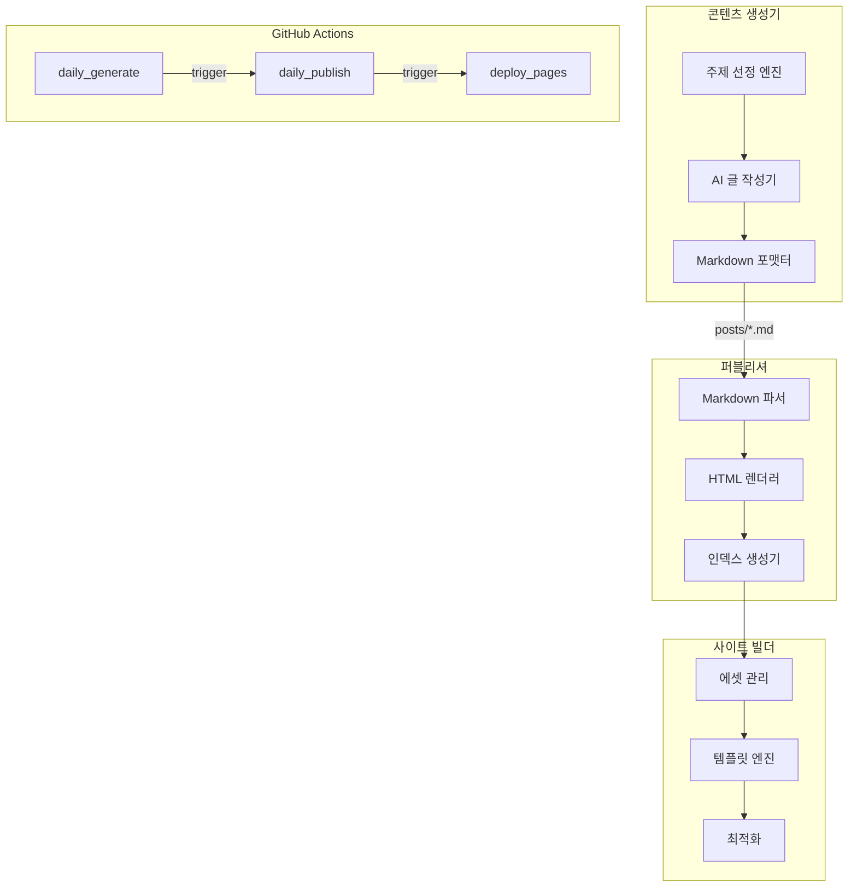

# Services

> 각 컴포넌트 상세 설명 — 생성기, 퍼블리셔, 사이트 빌더, GitHub Actions

## 컴포넌트 개요



## 콘텐츠 생성기

### 주제 선정 엔진 (`src/generator/topic.py`)

기존에 작성된 포스트 목록을 분석하여 중복되지 않는 새로운 주제를 선정합니다.

**주제 선정 로직**:
1. `posts/` 디렉토리에서 기존 포스트의 제목과 태그 수집
2. 사전 정의된 카테고리 풀에서 후보 주제 생성
3. 기존 포스트와의 유사도 검사로 중복 제거
4. 최종 주제 및 서브토픽 결정

**지원 카테고리**:
- Python, JavaScript, TypeScript
- DevOps, Docker, Kubernetes
- 시스템 디자인, 아키텍처
- 데이터베이스, 클라우드
- AI/ML, 데이터 사이언스
- 보안, 성능 최적화

### AI 글 작성기 (`src/generator/writer.py`)

LLM API를 호출하여 기술 블로그 포스트를 작성합니다.

**작성 프로세스**:
1. 주제와 서브토픽을 기반으로 프롬프트 구성
2. LLM API 호출 (OpenAI GPT-4 등)
3. 응답 파싱 및 품질 검증
4. Markdown frontmatter 추가
5. 파일 저장

**Markdown 출력 형식**:
```markdown
---
title: "Docker Multi-Stage Build 최적화"
date: 2024-01-15
tags: [docker, devops, optimization]
category: DevOps
---

# Docker Multi-Stage Build 최적화

본문 내용...
```

### Markdown 포맷터 (`src/generator/formatter.py`)

생성된 콘텐츠를 일관된 Markdown 형식으로 정리합니다.

- Frontmatter 검증 및 보완
- 코드 블록 언어 태그 확인
- 이미지 placeholder 삽입
- 목차 자동 생성

## 퍼블리셔

### Markdown 파서 (`src/builder/parser.py`)

Markdown 파일을 파싱하여 구조화된 데이터로 변환합니다.

**처리 항목**:
- YAML frontmatter 파싱 (제목, 날짜, 태그, 카테고리)
- Markdown 본문을 HTML로 변환
- 코드 블록 구문 강조 (Pygments)
- 내부 링크 처리
- 이미지 경로 변환

### HTML 렌더러 (`src/builder/renderer.py`)

파싱된 데이터를 HTML 템플릿에 적용하여 최종 페이지를 생성합니다.

**템플릿 구조**:
```
templates/
├── base.html       # 기본 레이아웃 (head, nav, footer)
├── post.html       # 개별 포스트 페이지
├── index.html      # 메인 인덱스 페이지
└── tag.html        # 태그별 포스트 목록
```

### 인덱스 생성기 (`src/builder/indexer.py`)

전체 포스트 목록을 기반으로 인덱스 페이지, 태그 페이지, RSS 피드를 생성합니다.

**생성 산출물**:
- `site/index.html`: 최신 포스트 목록 (페이지네이션)
- `site/tags/`: 태그별 포스트 목록 페이지
- `site/feed.xml`: RSS 피드
- `site/sitemap.xml`: 사이트맵

## 사이트 빌더

### 에셋 관리 (`AssetManager`)
- CSS/JS 파일을 `site/assets/`로 복사
- 이미지 최적화 (선택적)
- 파비콘, OG 이미지 설정

### 최적화
- HTML 압축 (minify)
- CSS 인라인화 (critical CSS)
- 불필요한 공백 제거

## GitHub Actions 워크플로우

### daily_generate.yml

```yaml
name: Daily Generate
on:
  schedule:
    - cron: '0 0 * * *'  # 매일 UTC 00:00
  workflow_dispatch:

jobs:
  generate:
    runs-on: ubuntu-latest
    steps:
      - uses: actions/checkout@v4
      - uses: actions/setup-python@v5
        with:
          python-version: '3.10'
      - run: pip install -r requirements.txt
      - run: python scripts/generate.py
        env:
          OPENAI_API_KEY: ${{ secrets.OPENAI_API_KEY }}
      - run: |
          git config user.name "github-actions[bot]"
          git config user.email "github-actions[bot]@users.noreply.github.com"
          git add posts/
          git commit -m "feat: add daily post" || exit 0
          git push
```

### daily_publish.yml

posts/ 변경 감지 시 HTML 빌드 및 site/ 업데이트를 수행합니다.

### deploy_pages.yml

site/ 디렉토리를 GitHub Pages에 배포합니다. `actions/deploy-pages` 액션을 사용합니다.
